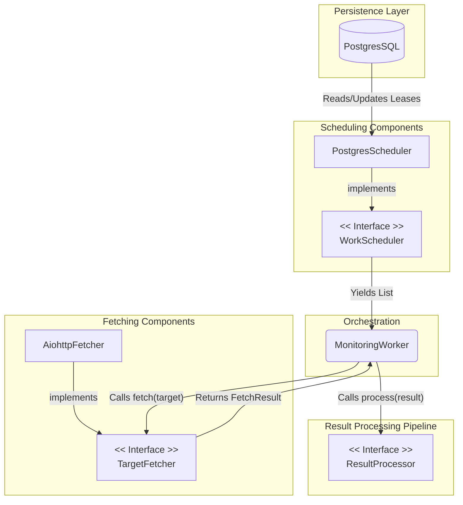

# Project Title

## Table of Contents

- [Introduction](#introduction)
- [Software Architecture](#software-architecture)
- [Dependencies Used](#dependencies-used)
- [Compromises Taken](#compromises-taken)
- [Getting Started](#getting-started)
    - [Prerequisites](#prerequisites)
    - [Installation](#installation)
- [How to Run and Test](#how-to-run-and-test)
    - [Running the Application](#running-the-application)
    - [Running Tests](#running-tests)
- [Technical Debt](#technical-debt)
- [Contact](#contact)

## Introduction

This project is an implementation of a website monitoring service.\
The program is designed to monitor the availability of many websites by performing periodic checks. For each check, it
collects metrics such as the request timestamp, response time, and HTTP status code, and stores these results in a
PostgresSQL database. It also includes an optional feature to validate page contents against a regular expression on a
per-URL basis.

## Software Architecture

The primary design goal for this solution was maintainability, leading to a decoupled, protocol-driven architecture
that is reliable, efficient, and testable.

**Database-Driven Scheduling**: To meet the requirement of not using an external scheduling library, the system
implements a
robust scheduler directly within PostgresSQL. This is achieved using a lease table pattern, where the database itself
manages the state of when each task is due. This approach provides excellent fault tolerance, as the scheduling state is
durable and survives application restarts.

**Efficient Concurrency**: To ensure efficiency and avoid wasteful, constant polling, the worker is event-driven. It
leverages PostgresSQL's LISTEN/NOTIFY for task wakeup. Database-level transactional locks (FOR UPDATE SKIP LOCKED)
manage concurrency and data integrity, ensuring reliable task processing even at scale.

**Decoupled Pipeline**: The application is structured as a pipeline of components, where each major function is governed
by
an abstract interface. This includes:

- _WorkScheduler_ for acquiring tasks
- _TargetFetcher_ for executing HTTP calls,
- _ResultProcessor_ components for handling outcomes (e.g., persisting results, updating metrics).\

This design promotes high testability and makes the system flexible and easy to upgrade.

### Technical Choices & Constraints

This solution adheres to all the **constraints** outlined in the project description:

_Language_: The application is written exclusively in Python.\
_Database_: The system uses PostgresSQL and interacts with it using the asyncpg library for direct, raw SQL queries. No
ORM
libraries were used, as per the requirements.
_Concurrency & Scheduling_: All concurrency and scheduling are handled natively using Python's built-in asyncio library
in
combination with the database-driven logic described above. No external scheduling libraries were used.
The code is designed to be production quality, with a strong emphasis on clarity, error handling, and testing. For
details on how to set up the database, install dependencies, and run the application and its tests, please see the
sections below.

## Dependencies Used

### CORE Dependencies

#### asyncpg

**Description**: A high-performance, asynchronous database driver for PostgresSQL.

**Motivation**: A hard constraint of the project is the prohibition of Database ORM libraries, requiring the use of a "
Python DB API or
similar library and raw SQL queries" instead.
Asyncpg meets these requirements perfectly. It is a non-ORM driver that allows for writing raw SQL, and its native
integration with asyncio ensures that database operations are non-blocking and do not halt the concurrent execution of
other tasks.

#### aiohttp

**Description**: An asynchronous HTTP client/server library for asyncio.

**Motivation**: As the entire application's concurrency model is built on asyncio, it is essential to use an HTTP client
that is also
asynchronous. Using a standard, blocking library would negate the benefits of asyncio by halting the entire event loop
for every network request.
Aiohttp is a mature and powerful library that provides the necessary functionality for making HTTP requests
asynchronously. It will be used to collect the response time and the HTTP status code for each check.

#### aiologger

**Description**: An asynchronous logging library that allows log without blocking on I/O.

**Motivation**: As the entire application's concurrency model is built on asyncio, it is essential that all I/O
operations, including logging, are non-blocking to achieve production quality. Using Python's standard logging module in
its default, synchronous configuration would introduce blocking file or console I/O. This can halt the event loop for
every log message, severely degrading the performance and responsiveness required to monitor thousands of sites

## Compromises Taken

### Scheduling Model

#### CHOSEN: database-driven scheduler

The selected model is a database-driven scheduler using a dedicated "lease table" in PostgresSQL. In this pattern, the
application's worker process queries the database for tasks that are due, locks the corresponding rows to prevent race
conditions, and then executes the work.

This represents a deliberate compromise: we are accepting a higher degree of interaction with the database in exchange
for superior fault tolerance and data integrity. By persisting the scheduling state (next_fire_at), the system can
gracefully recover from restarts and guarantee that tasks are not lost or skipped, a key requirement for production
quality code.

The potential inefficiency of database polling is mitigated by using PostgresSQL's LISTEN/NOTIFY system. This allows the
worker to remain idle until work is likely available, thus meeting the efficiency requirement without constant, empty
queries. This choice directly supports the main design goal of maintainability by leveraging the existing, reliable
database infrastructure.

#### Alternative Approaches Considered

Several alternative scheduling models were evaluated and rejected based on the project's specific constraints and goals.

##### In-Memory Scheduler

**Description**: An approach where all scheduling logic resides within the application's memory, using asyncio timers to
trigger tasks.\
**Trade-off**: While this model offers the highest performance and lowest database load, it was rejected because it
fails
the critical requirement for fault tolerance. An application crash would lead to the complete loss of all scheduling
state, making it unsuitable for a production-quality system that must handle errors reliably.

##### State Columns in Main Table

**Description**: A variation of the database-driven approach where scheduling columns (next_fire_at, etc.) are added
directly to the main monitored_targets table instead of a dedicated lease table.\
**Trade-off**: This was considered as it simplifies the database schema. However, it was rejected because it compromises
the
main design goal of maintainability. Mixing operational state with core business data violates the Single Responsibility
Principle and can lead to long-term performance issues (e.g., table bloat, lock contention) on a critical business
table.

##### External Message Queue (e.g., Redis/Celery)

**Description**: Using a dedicated, external system designed for task queuing and scheduling.\
**Trade-off**: Architecturally, this is a very robust and scalable solution. However, it was rejected as it introduces a
significant external dependency and operational overhead. Given the project's scale "... at least some thousands of
separate sites ..." and the explicit constraint against external schedulers, this was deemed unnecessary complexity. The
chosen database-centric model provides sufficient power without the extra infrastructure.

## Technical Debt

### Issue: Synchronous Logging in an Asynchronous Application

**Description**: The current implementation uses Python's standard logging module in its default, synchronous
configuration. Log messages
are processed and written to their destination (e.g., console or file) directly from the asyncio event loop.

**Impact**: In an asyncio application, any synchronous I/O operation has the potential to block the event loop. While
often fast,
file or console I/O for logging can introduce small latencies. At the target load of a few hundred operations per
second, these small blocking calls can accumulate, creating a significant performance bottleneck. This would temporarily
halt all concurrent tasks (e.g., HTTP checks, database queries) and undermine the goal of creating a high-performance,
production quality code.

**Proposed Solution**: To resolve this, the logging system should be moved to a non-blocking model. The recommended
approach is to implement a
queue-based logger:

An async logger handler would be created to place formatted log messages into an asyncio.Queue. This is a rapid,
in-memory operation that would not block the event loop.
A separate, dedicated asyncio task would run in the background. Its sole responsibility would be to consume messages
from the queue and perform the actual (potentially blocking) I/O of writing them to their final destination.
This would fully decouple the logging I/O from the main application logic, ensuring that logging operations can never
impact the performance or latency of the core monitoring tasks.

### Issue: CI/CD prepare a pipeline to perform database migrations

TODO

### Issue: Missing open-telemetry instrumentation

TODO

## CONTACT

Name: Gianluigi De Marco\
Email: dem.gianluigi@gmail.com\
GitHub: [link](https://github.com/dmgiangi) \
LinkedIn: [link](https://www.linkedin.com/in/gianluigi-de-marco-890671195/)
